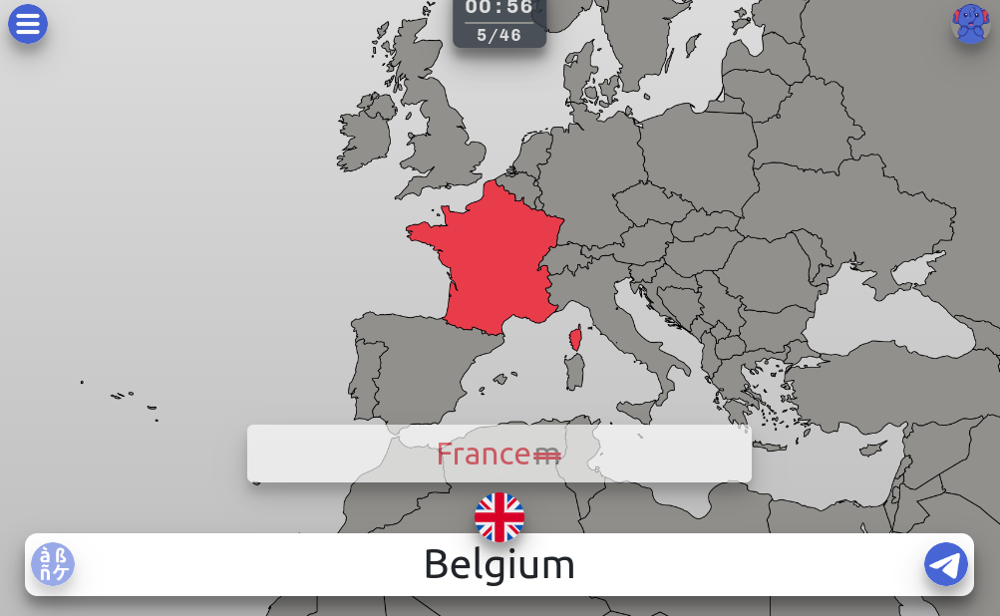

# Elephantizer - The Ultimate Memorization and Typing App

[Elephantizer](http://elephantizer.com) is a memory and typing application. Thanks to an ingenious system of flash cards and active recall, you memorize the answers to questions on topics you select, such as:

* [countries on the map](https://elephantizer.com/en/geography/countries-on-the-map/europe/),
* [the Greek aphabet](https://elephantizer.com/en/foreign-languages/greek/lowercase-alphabet/),
* [foreign language vocabulary](https://elephantizer.com/en/foreign-languages/french/colors/)...

At the same time, you improve your keyboarding skills.

## Fast Memorization
For each flash card, you have to type the correct answer to the question asked. The application then calculates a multi-criteria score, taking into account response time, typing speed and mistyped characters. The questions you have the most difficulty memorizing will then be suggested to you more frequently. You'll then have question sequences customized to your learning capacity.

## Long-Term Retention
If you practice regularly, you'll find that you'll memorize very quickly and over the long term. In fact, the application will more frequently suggest the cards you're having the hardest time remembering. However, the cards you already know by heart will also be suggested to you from time to time, to maintain and reinforce the knowledge you've already acquired over the long term.

## Typing Skills
As you type the answers, the application also measures your typing speed in words per minute (wpm) and the number of characters correctly or incorrectly typed. At the same time, it helps you improve your typing speed and accuracy.

## Correct Spelling
Unlike other flash card systems, you learn not only the correct answer, but above all the correct spelling. As the answers are typed on the keyboard, Elephantizer analyzes and checks every character in the answer, so you learn both the answer and its spelling.

## Conclusion
Whether you're a student, a senior citizen or a geek, you're bound to find memorization tests that will help you improve both your typing skills and your general knowledge.

Start your journey to better memorization and knowledge retention today with Elephantizer!

## TODO

* There is a bug when calculating the accuracy => enter Egypte when the expected answer is Egypt => accuracy = 100%
* Delete non confirmed users
* Fix the bug in the menu with collapse: https://github.com/twbs/bootstrap/issues/39385
* Add the stop button in the timer in infinite mode
* Display Elephantizer when user login with Google
* Fix bug when a second client load a new deck
* Add the side card right / wrong
* Add Jersey, Guernesey and Sercq in countries
* Add irregular verbs
* Add line chart for individual deck in the results
* Finalize the test with oxymorons, synonyms, etc. by definition
* Add contact page in the menu
* Resize the map of russia outline
* Change the github owner
* Add the german loader
* Check if the first erroneous character stops the search time

## Done

* ~~Add a button to remove deck in the selection~~
* ~~Review the calculation of probas to enable the most frequently asked questions to be picked.~~
* ~~Create a site map for SEO with one url for each deck~~
* ~~Add a line chart in the results to display progress~~
* ~~Add/Remove history listener when user log in/out~~
* ~~Remove the ISO folder in the catalog~~
* ~~Add the number of remaining questions in series mode (10/50)~~
* ~~Add the flag in the answer bar~~
* ~~Load selection from url query, for example: https://elephantizer.com/?selection=en/geography/countries-on-the-map/africa___en/geography/countries-on-the-map/europe~~
* ~~Switch the radio and checkbox in the memory test selection menu~~
* ~~Add special characters~~
* ~~Add aditional statistics in the result modal~~
* ~~Add bottom button in the menu~~
* ~~Add categories Math, Language, Foreign, languages ...~~
* ~~Revise final score calculation to reflect actual WPM~~
* ~~Move css in catalog~~
* ~~Translate the result cards~~
* ~~Remove the hashtag in the results cards for translation~~
* ~~Show the cards in the results~~
* ~~Add Greek alphabet in English~~
* ~~Add Greek uppercase alphabet~~
* ~~Fix bug: two times the same question shouldn't happen~~
* ~~Remove answer displayed when mode is series~~
* ~~On Firefox transition between questions are flickering~~
* ~~On Firefox, caret is not centered~~
* ~~On Firefox, space do not always submit the answer~~
* ~~When user is not logged, focus is not set when the menu is closed~~
* ~~⚠ When user is not logged results are not displayed ⚠~~
* ~~⚠ When user is not logged focus is not set in the answer bar ⚠~~
* ~~Fix bug when animation duration for the results is equal to 0~~
* ~~Add a button to show the last results in the menu~~
* ~~* Fix bug when the user don't answer to any question~~
* ~~Fix bug on key press when exiting the menu or results the focus is not set on the overlay~~
* ~~⚠ Once the user is logged, download settings and statistics ⚠~~
* ~~Add a parameter in the settings for choosing the results animation duration~~
* ~~Add `{ once: true}` in the event listener when all series are loaded~~
* ~~Add tooltips on results titles~~