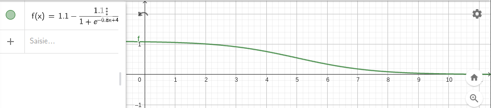

# Memory Test 

This module store and calculate the performances of the current memory test. 
* WPM
* Time to first ratio

## Time to first key ratio

The following formula is used to convert the time to first key into ratio in the range [0; 1]:

