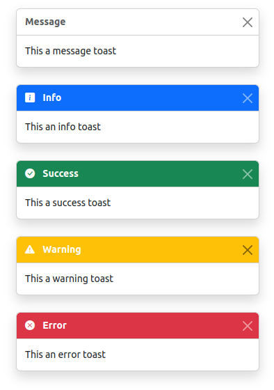

# Notifications

Display a notification to the user based on [Bootstrap Toasts](https://getbootstrap.com/docs/5.3/components/toasts/).


## Usage

Import the library:

``` js
import notifications from 'Js/notifications';
```

`notifications` is a singleton. To create a Toast notification, call one of the following method after importing the module:

``` js
notification.error(title, message, duration);
notification.warning(title, message, duration);
notification.success(title, message, duration);
notification.info(title, message, duration);
notification.message(title, message, duration);
```

* The first parameter is the Toast title
* The second parameter is the Toast content
* The third parameter is the elay in milliseconds before hiding the toast.

Here are some usage examples:

``` js
notifications.error("Error", "This an error message", 3000);
notifications.warning("Warning", "This a warning message", 3500);
notifications.success("Success", "This a success message", 4000);
notifications.info("Info", "This an info message", 4500);
notifications.message("Message", "This a message", 5000);
```

The above example stack the Toast as on the following image:



## Unit Test

A unit test is available in [/src/unit-test/notifications/](/src/unit-test/notifications/). Unit test can only run in development mode. 


## Error Categories

Error codes are classified in categories (1000 error code for each module):

| Error Code Range | Description | Module |
| ---------------- | ----------- | ---- |
|  [1000 : 1999]     | Error during registration | [signup](/src/js/signup)  |
|  [2000 : 2999]     | Error in account management | [account](/src/js/account)  |
|  [3000 : 3999]     | Error in account verification | [verification](/src/js/verification)  |
|  [4000 : 4999]     | Error during sign in | [sign](/src/js/sign) |
|  [5000 : 5999]     | Error during settings operations | [settings](/src/js/settings) |
|  [6000 : 6999]     | Error during series operations | [series](/src/js/series) |
|  [7000 : 7999]     | Error in the selection module | [selection](/src/js/selection) |
|  [8000 : 8999]     | Error in the statistics module | [statistics](/src/js/statisctics) |


## Error List

| Error Code  | Description | File |
| ----------- | ----------- | ---- |
| 1000  | Error while creating new user with email/password | [/src/js/signup/model.js](/src/js/signup/model.js)  |
| 2000  | Error while updating username | [/src/js/account/model.js](/src/js/account/model.js)  |
| 3000  | Error while sending verification email | [/src/js/verification/model.js](/src/js/verification/model.js)  |
| 3001  | Error while cheking if email is verified | [/src/js/verification/model.js](/src/js/verification/model.js)  |
| 4000  | Error during sign in with email/password | [/src/js/signin/model.js](/src/js/signin/model.js)  |
| 4001  | Error during sign in with Google account | [/src/js/signin/model.js](/src/js/signin/model.js)  |
| 4002  | Error while sending reset password email | [/src/js/signin/model.js](/src/js/signin/model.js)  |
| 5000  | Error while saving current settings | [/src/js/settings/model.js](/src/js/settings/model.js)  |
| 5001  | Error while listening current settings | [/src/js/settings/model.js](/src/js/settings/model.js)  |
| 5002  | Error while downloading current settings | [/src/js/settings/model.js](/src/js/settings/model.js)  |
| 6000  | Error while downloading a deck | [/src/js/series/model.js](/src/js/series/model.js)  |
| 7000  | Error while removing non loading deck | [/src/js/selection/model.js](/src/js/selection/model.js)  |
| 8000  | Error while saving statistics on Firestore | [/src/js/statisctics/model.js](/src/js/statisctics/model.js)  |

Shortcut to preview Markdown in VSCode : Ctrl+K V