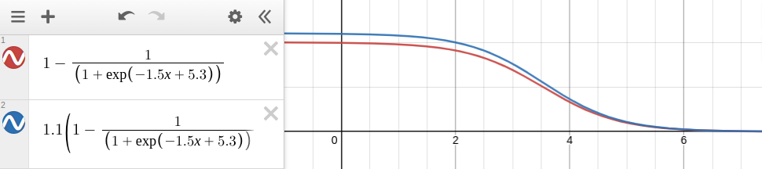

# Memory Test 

This module store and calculate the performances of the current memory test. 
* WPM
* Time to first ratio

## WPM

WPM (Words Per Minute) is the typing speed. 

WPM = 12000*(Number of characters / Time in milliseconds)

$$ WPM = 12000 \times { N_{characters} \over T_{milliseconds} }$$

* Length +1 to consider the last space
* Characters per millisecond = Number of character / typing time
* Characters per minute = 60000 * Characters per millisecond 
* Words per minute = Characters per minute / 5

## Time to first key ratio

The following formula is used to convert the time to first key into ratio in the range [0; 1]:

